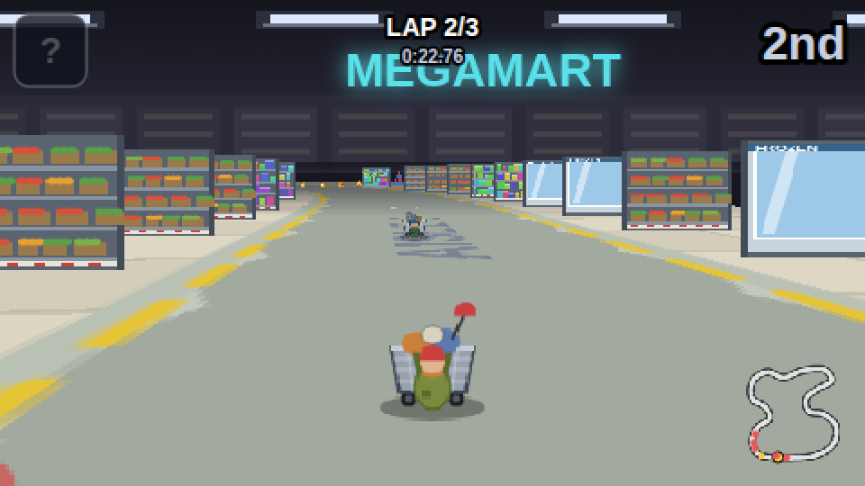
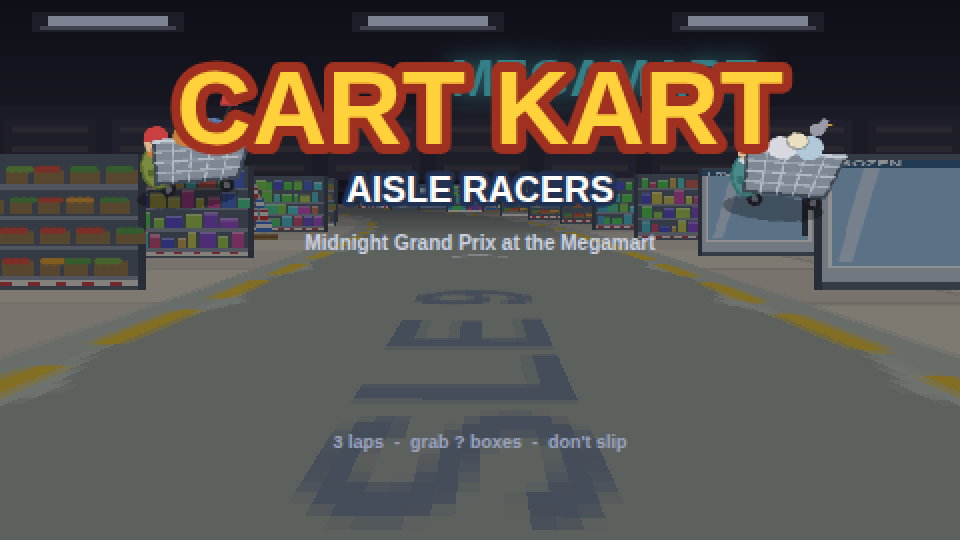
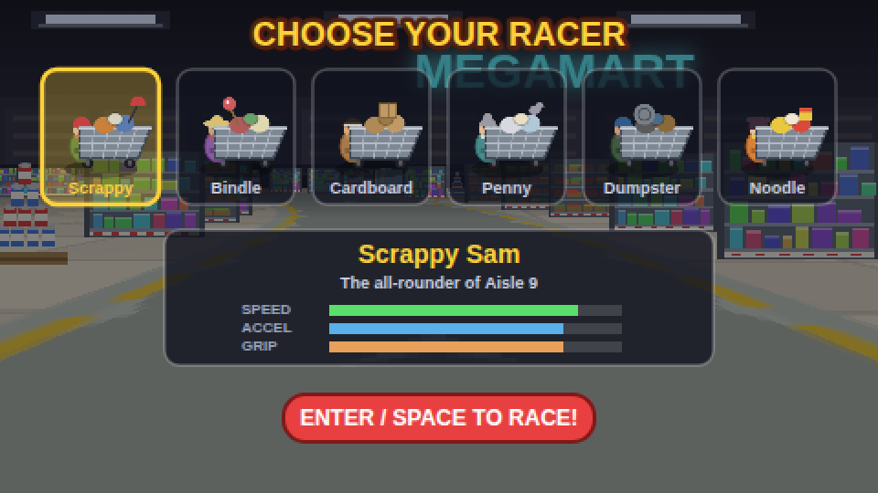

# Cart Kart: Aisle Racers

A Mario Kart-style pseudo-3D racing game for iOS: six scrappy street racers push
their overloaded shopping carts through the **Midnight Megamart** after hours —
3 laps around Aisle 9, past the frozen section, through the produce hairpin,
and across the checkout-lane finish line.



The renderer is a classic SNES-style "Mode 7" scanline floor projection with
billboard sprites, running on an HTML5 canvas at a retro 480x270 internal
resolution. **Everything is procedural** — every sprite, the track texture, the
audio (engine hum, sound effects, music loop) — so there are zero binary asset
dependencies and no build step.

## Features

- 6 playable racers with different speed / acceleration / grip / weight stats
  (Scrappy Sam, Bindle Betty, Cardboard Carl, Penny Pigeon, Dumpster Dave,
  Noodle Nelly), each with a uniquely-loaded cart
- Drift + mini-turbo boost system (hold DRIFT through a corner, release for a spark boost)
- Grocery items from `?` cereal boxes, weighted by race position:
  banana peel, soup-can projectile, milk-jug spill (leaves a slippery puddle),
  and energy-drink boost
- 5 AI opponents with hazard avoidance, overtaking, and rubber-banding
- Wet-floor slick zones, pallet-display obstacles, shelving-wall collisions
- Lap counting, live ranking, minimap, wrong-way warning, results screen
- Full touch controls (steer / drift / item), auto-acceleration, landscape-first
  layout with safe-area insets — plus keyboard support on desktop

## Play it

### In a browser (quickest)

```bash
cd cart-kart/web
python3 -m http.server 8000
# open http://localhost:8000
```

Keyboard: arrows / WASD steer, hold **Shift** or **Space** to drift,
**X** uses the item, **Down** brakes. Acceleration is automatic.

### On iPhone / iPad as a native app

Open `ios/CartKart.xcodeproj` in Xcode (15 or newer), select your signing team
under *Signing & Capabilities*, and run on a device or simulator. The app is a
full-screen landscape WKWebView that ships the `web/` folder inside the bundle —
no network needed, no dependencies to install.

### As a home-screen web app

Host `web/` anywhere (it is plain static files), open it in Safari on iOS and
use **Share → Add to Home Screen**. The manifest is configured for fullscreen
landscape play.

## Project layout

```
cart-kart/
├── web/                     # the game (plain HTML/CSS/JS, no build step)
│   ├── index.html
│   ├── css/style.css        # stage, touch controls, rotate prompt
│   └── js/
│       ├── util.js          # math helpers, input (keyboard + touch)
│       ├── audio.js         # procedural WebAudio engine/sfx/music
│       ├── sprites.js       # all art drawn into canvases at boot
│       ├── track.js         # Midnight Megamart circuit + surface lookup
│       ├── render.js        # Mode-7 floor + billboard sprite renderer
│       ├── game.js          # physics, drift, items, AI, race flow
│       ├── ui.js            # title / select / HUD / results screens
│       └── main.js          # boot + loop + resize
└── ios/                     # native wrapper
    ├── CartKart.xcodeproj
    └── CartKart/CartKartApp.swift   # SwiftUI + WKWebView shell
```



